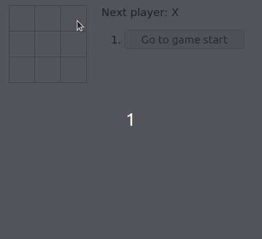

# Tic Tac Toe from React Tutorial



This project was bootstrapped with [Create React App](https://github.com/facebook/create-react-app) and follows the [Intro to React Tutorial](https://reactjs.org/tutorial/tutorial.html#lifting-state-up).

## Usage

```bash
npm install
npm start
```

## My Coding Experience

I tried to implement the app by myself as much as possible but found several core implementations difficult:

- accepting that I had to lift state from class `Square` to class `Board` and then again from class `Board` to class `Game`
  - was trying to stick to OOP principles and let smaller classes carry their own state (e.g. passing the square index all the way up from `Square` to `Game` felt wrong. I wanted to isolate Game from that implementation detail)
- passing a parameter (i.e. square index `i`) from component to `handleClick()`. I didn't think it would take the parameter

VS Code's IntelliSense was kind of trash. It kept suggesting Emmet abbreviations (which were always wrong) and filled up with generic JS stuff instead of the methods I was looking for. Using TypeScript would probably have been a much better experience.

## Lessons

- React is a declarative framework; you modify state in a tightly controlled manner (i.e. `this.setState()`)
- In a component, most methods have either one job or the other: `render()` the component or `handleClick()` (or any other `handle<event>`)
  - In `render()`, you usually tie a component to an event listener that calls `handle<event>()`
  - In `handle<event>()`, you usually call `this.setState()`, which will call `render()`
  - e.g. `Game.jumpTo()` is a `handle<event>()` type of method
  - `calculateWinner()` does not fall into either job category; it's just a helper function
- Maybe isolating state is not as important in React as it is in other programming styles
